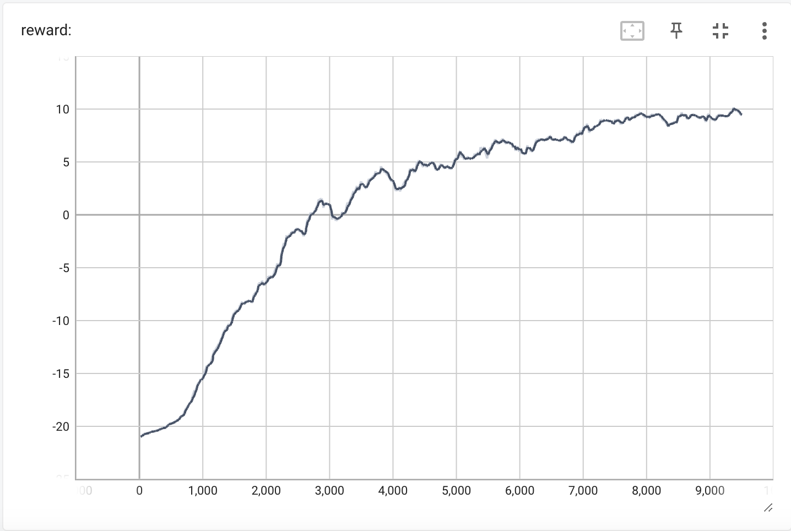

# I try gradient descent on pong-from-pixels and it does not go well
Refactoring of "Deep Reinforcement Learning: Pong from Pixels" from Andrej Karpathy with gradient descent comparisons

## motivation
bored! bored!!

## Overview of gradient descent algorithms
I liked this [blog post](https://towardsdatascience.com/a-visual-explanation-of-gradient-descent-methods-momentum-adagrad-rmsprop-adam) by Lili Jiang, which visually explains the different version of gradient optimization. TLDR:

- Vanilla gradient descent gets caught in local minima -> Momentum uses historical gradients to accelerate the algorithm and give it enough "momentum" to keep it moving in a general direction.
- AdaGrad takes momentum and squares it, creating the second moment. This allows it to focus on features that have been updated less. It computes an "adaptive" gradient for each feature, making it better for sparse features.
- RMSProp speeds up AdaGrad by decaying the squared momentum and preventing it from blowing up.
- Adam is generally thought of as combining RMSProp (second moment) with momentum (first moment) and generally converges faster and works with sparse features.

### 1. Vanilla gradient descent
```math
\Delta = -\gamma * \text{gradient}
```

Reminder: the gradient is computed in backprop, where $`L=y-\hat{y}`$. We take the derivative of loss respective to $`\hat{y}`$, which is a series of functions $`f_1(f_2(...(x)))`$, where each $`f`$ is a layer of the neural network. Rather than calculating the gradient analytically, we calculate it empirically (with the actual values of the weights). A gradient of 4 for $`w`$ tells us that increasing the weight will increase the loss by a rate of 4 in the current formulation.

Intuition: The blog explains normal gradient descent “like using a flashlight to find your way in the dark.” At any point in time, we can only see the few feet ahead of us that is illuminated by the flashlight, which I found to be a very helpful analogy.

### 2. Momentum
```math
M_t = \text{sum of gradient}_t = \text{gradient} + \rho * \text{sum of gradient}_{t-1}
\Delta = -\gamma * M
\Delta = -\gamma * \text{gradient} + \rho * \Delta_{t-1}
```

Intuition: This is very similar to vanilla gradient descent, except now my $`\Delta`$ accounts for the current gradient as well as the previous gradients, weighted by $`\rho`$. The addition of past gradients acts as "momentum," almost like a sort of memory that tells me what general direction I've been heading in. $`\rho`$ tells us how much to care about past vs present gradients, acting as "friction" that eventually slows the momentum effect of previous timesteps. If $`\rho=0`$, then I only care about the current gradient and it ends up being the same as vanilla descent. If $`\rho=1`$, then I may end up with too much minimum and overshoot my goal. Ideally, a good $`\rho`$ will let you escape local minima without overshooting the global minima you're aiming for.

### 3. AdaGrad
```math
M'_t = \text{sum of gradient squared}_t = \text{gradient}^2 + \text{sum of gradient}_{t-1}
\Delta = -\gamma * \frac{\text{gradient}}{\sqrt{M'}}
```

Intuition: AdaGrad takes the idea of momentum and then squares the sum of past gradients. Why square? Squaring forces the momentum to grow faster, which indicates which features have been updated most in the past. The idea is that dividing by squared momentum will dis-incentivize updating features that have already gone through lots of updates (and thus have high accumulated momentum) and instead focus on features that need more updating. In other words, Ada updates features at different rates, which can help avoid saddle points.

### 4. RMSProp
```math
C_t = \text{sum of gradient squared}_t = (1 - \rho) * \text{gradient} + \rho * \text{sum of gradient squared}
\Delta_t = -\gamma * \frac{\text{gradient}}{\sqrt{C_t}}
```

Intuition: AdaGrad is slow because the squared terms blow up fast and increase computation time. RMSProp is basically AdaGrad, but faster, because it keeps the squared term using the $`\rho`$ decay rate. The smaller $`\rho`$ is (usually between 0 and 1), the faster, although you trade off the momentum effect. The original pong from pixels code uses RMSProp, which uses a cache to store previous second moment/sum of gradient squared information.

### 5. Adam
Typically $`\beta_1 = 0.9$, $\beta_2 = 0.99`$
```math
M_t = \beta_1 * M_{t-1} + (1 - \beta_1) * \text{gradient}
C_t = \beta_2 * C_{t-1} + (1 - \beta_2) * \text{gradient}
\Delta = -\gamma * \frac{M}{\sqrt{C}}
```

Intuition: Adam optimizers are typically what we use today with Pytorch or Tensorflow. Adam combines the speed of momentum ($`M_t = \text{sum of gradient}`$) with the ability of AdaGrad/RMSProp to adapt and change directions ($`C_t = \text{sum of gradient squared}`$). There are some pockets of StackOverflow/the Internet where people seem to prefer RMSProp for applications like reinforcement learning with non-stationary distributions, but I didn't look too closely into this.

Note: On illustration $e$ of Adam optimization in the TDS blog, note that dividing momentum $`M`$ by sum of squares $`C`$ has the effect of almost normalizing the magnitude of momentum.

## Implementing RMSProp and Adam in Python

I ran a few different experiments for this one; here's a quick summary:
- Experiment 1: Tried running Karpathy's code as originally written with one tiny modification. Convergence was pretty slow, because of the one tiny modification I made (obviously). I kept resetting the momentum buffers in addition to the gradient buffer at the end of each episode, which is silly because the whole point is that it's supposed to record historical momentum.
- Experiment 2: Stopped resetting the buffers, but reward suddenly kept getting WORSE and converging to worst possible reward of -21. This one stumped me for so long until I asked someone for help and realized that unlike most ML problems, you're trying to maximize reward instead of minimizing loss. I was correctly finding the gradient to maximize reward each time, but updating in the complete opposite direction by running
```python
  model[k] -= learning_rate * m_hat / (np.sqrt(c_hat) + epsilon)
```
Instead, I should have been running
```python
  model[k] += learning_rate * m_hat / (np.sqrt(c_hat) + epsilon)
```
- Experiment 3: I fixed the model update and reward started increasing using RMSProp. It was really, really slow, so halfway through I started searching up things like "gradient descent so slow why," at which point I realized there were different gradient optimization algorithms and started writing this blog.
- Experiment 4: After doing some reading, I implemented Adam optimization from scratch, which is pretty simple for a single step:
```python
  # Momentum buffer
  m[k] = b1 * m[k] + (1 - b1) * g
  # Squared momentum buffer
  c[k] = b2 * c[k] + (1 - b2) * g**2

  # Buffer updates
  m_hat = m[k] / (1 - b1**episode_number)
  c_hat = c[k] / (1 - b2**episode_number)

  # Update model
  model[k] += learning_rate * m_hat / (np.sqrt(c_hat) + epsilon)

  # Reset gradient buffer only
  gradient_buffer[k] = np.zeros_like(v)
```
Instead of one RMSProp cache for momentum, I keep two caches, one for momentum ($`m`$) and one for sum of squared gradients ($`c`$). Then I run this all locally on my computer, which really hates me at this point, and think to myself "hey, I should learn how to use SageMaker." But I don't, because sometimes it's a Friday and you just want to have a good time playing beach volleyball instead of languishing in CS student self-loathing. Luckily, Adam converges much faster (see Tensorboard plots below). After about 3,000 episodes and 3 hours, I end up with an agent that is slightly better than the computer. After about 8,000 episodes and 8 hours, I my agent plateaus at an average +10 reward each game. This is a pretty fast compared to previous pong-from-pixels [blogs](https://www.storminthecastle.com/posts/pong_from_pixels/) I came across - maybe because hardware has sped up a lot in the last few years, maybe because I'm using Adam. I'd like to think it's me, so we're going to go with that.

<p align="center">
  
  <!--  -->
</p>

| | |
|:-------------------------:|:-------------------------:|
|  CAPTION 1 |   CAPTION 2 |
| CAPTION 3 |  |